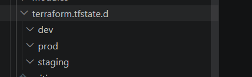
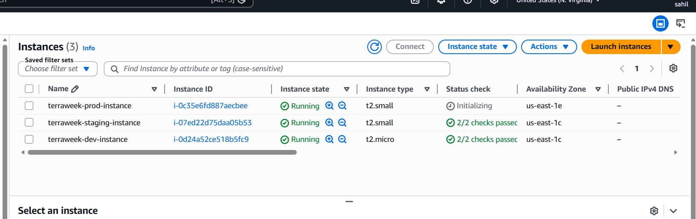

## Challenge Tasks

### Task 1: Learn Terraform Workspaces
Before building the project, understand workspaces:

```bash
mkdir terraweek-capstone && cd terraweek-capstone
terraform init

# See current workspace
terraform workspace show                    # default

# Create new workspaces
terraform workspace new dev
terraform workspace new staging
terraform workspace new prod

# List all workspaces
terraform workspace list

# Switch between them
terraform workspace select dev
terraform workspace select staging
terraform workspace select prod
```

Answer:
1. What does `terraform.workspace` return inside a config?
terraform.workspace is a built-in Terraform expression that returns the name of the currently selected workspace, allowing configurations to behave differently for environments such as dev, staging, and prod.
2. Where does each workspace store its state file?

each workspace store its seperate state file in the terraform.tfstate.d directory 
terraform.tfstate.d/
    dev/
      terraform.tfstate

    staging/
      terraform.tfstate

    prod/
      terraform.tfstate
3. How is this different from using separate directories per environment?
if we write seperate directory per environment then we have to write the 
iac code for each directory terraform workspaace principal says same code but just different state file 

---

### Task 2: Set Up the Project Structure
Create this layout:

```
terraweek-capstone/
  main.tf                   # Root module -- calls child modules
  variables.tf              # Root variables
  outputs.tf                # Root outputs
  providers.tf              # AWS provider and backend
  locals.tf                 # Local values using workspace
  dev.tfvars                # Dev environment values
  staging.tfvars            # Staging environment values
  prod.tfvars               # Prod environment values
  .gitignore                # Ignore state, .terraform, tfvars with secrets
  modules/
    vpc/
      main.tf
      variables.tf
      outputs.tf
    security-group/
      main.tf
      variables.tf
      outputs.tf
    ec2-instance/
      main.tf
      variables.tf
      outputs.tf
```

Create the `.gitignore`:
```
.terraform/
*.tfstate
*.tfstate.backup
*.tfvars
.terraform.lock.hcl
```

**Document:** Why is this file structure considered best practice?
organized
modular
reusable
production-ready


### Task 5: Deploy All Three Environments
Deploy each environment using its workspace and tfvars file:

**Dev:**
```bash
terraform workspace select dev
terraform plan -var-file="dev.tfvars"
terraform apply -var-file="dev.tfvars"
```

**Staging:**
```bash
terraform workspace select staging
terraform plan -var-file="staging.tfvars"
terraform apply -var-file="staging.tfvars"
```

**Prod:**
```bash
terraform workspace select prod
terraform plan -var-file="prod.tfvars"
terraform apply -var-file="prod.tfvars"
```

After all three are deployed, verify:
```bash
# Check each workspace's resources
terraform workspace select dev && terraform output
terraform workspace select staging && terraform output
terraform workspace select prod && terraform output
```

Go to the AWS console and verify:
- Three separate VPCs with different CIDR ranges
- Three EC2 instances with different instance types
- Different Name tags per environment: `terraweek-dev-server`, `terraweek-staging-server`, `terraweek-prod-server`

**Verify:** Are all three environments completely isolated from each other?
